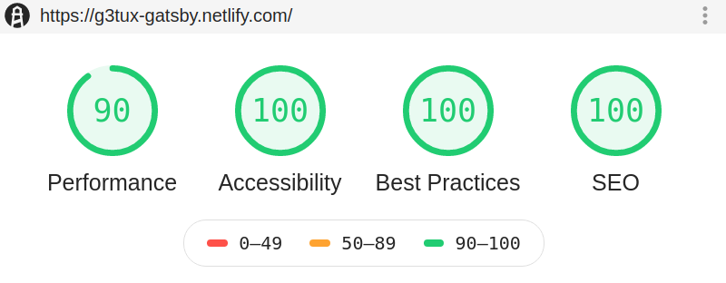

Learn to make my own Gatsby theme. Fully customized, based on [gatsby/gatsby-starter-default](https://github.com/gatsbyjs/gatsby-starter-default)

## 🔥 Lighthouse Score

### [Live Demo](https://g3tux-gatsby.netlify.com)

© 2019 edytk, All rights deserved.
